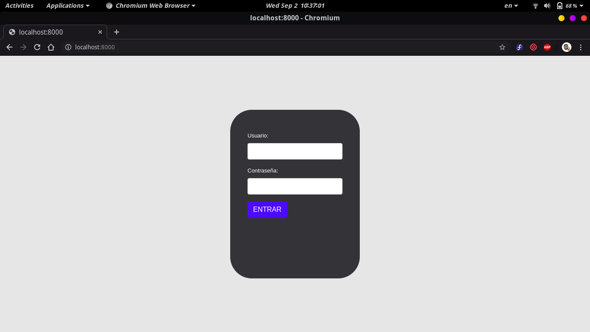
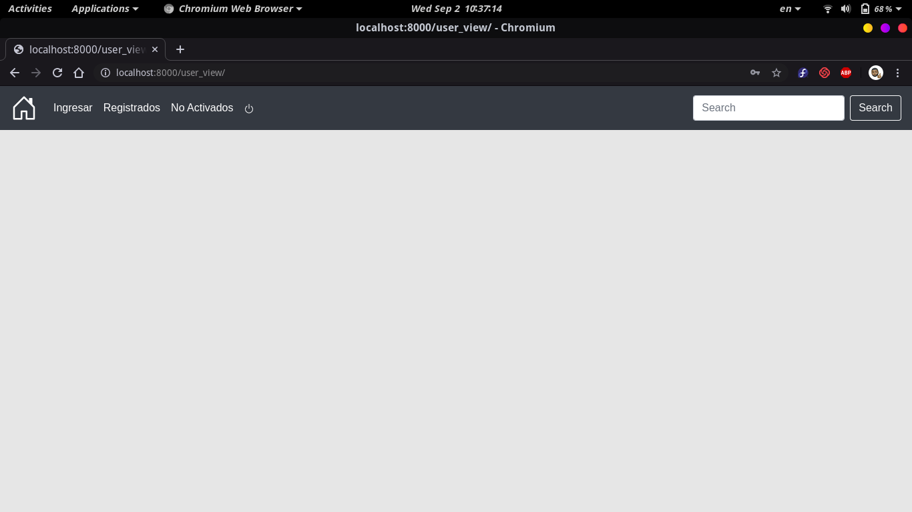
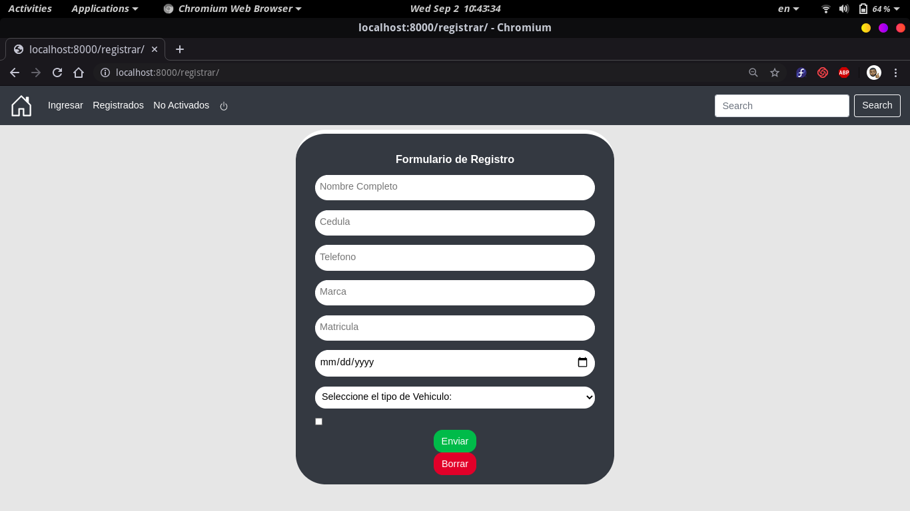
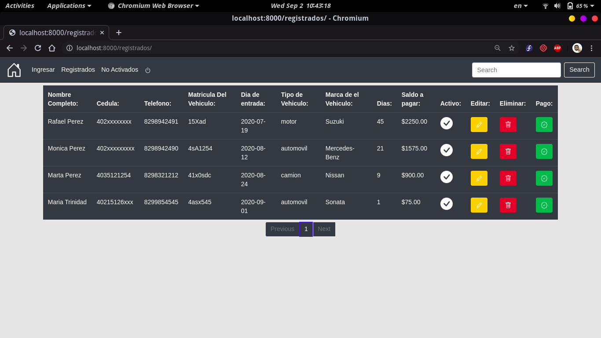
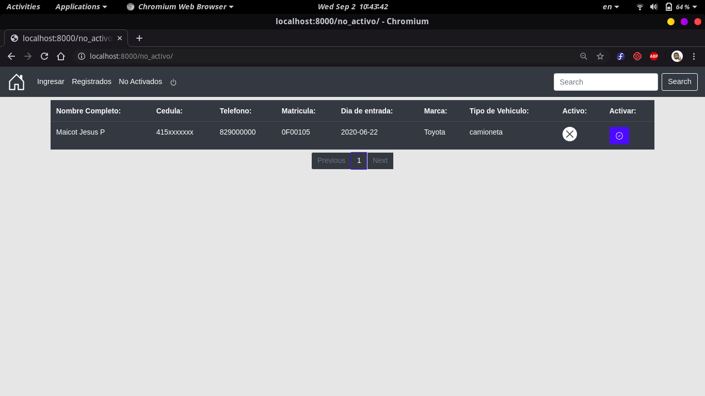

# Garajesistema
Gestionar los vehiculos de los clientes.

Sistema que permite introduccir clientes y sabes el dia de entrada, cuantos dias tiene guardado el automovil o motor de el cliente y le da el precio.

Descargar el archivo zip

Install pipenv

pipenv shell para iniciarlo en consola

Install dependencies:

pip install -r requirements.txt

Tools

Python
Django
Mysql

